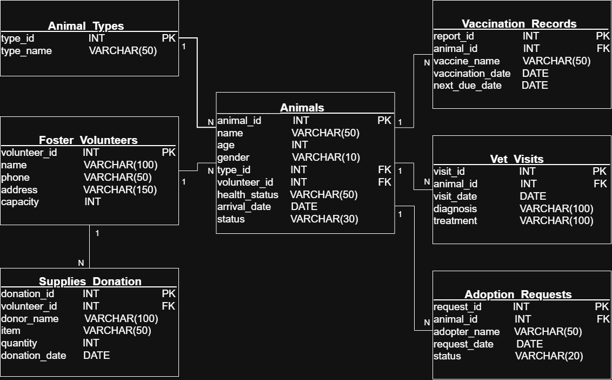

# 🐾 Stray Animal Foster & Health Tracking System

This repository contains the **Phase 1 Milestone** for the **Applied SQL** database project, designed to solve real-world data fragmentation in stray animal management.

---

## 🎓 Course Context
* **University:** Yildiz Technical University
* **Department:** Mathematical Engineering
* **Course:** MTM4692 - Applied SQL 
* **Instructor:** Fettah KIRAN
* **Project Team:** Deniz Yılmaz, Batuhan Tekinalp, Damla Hilal Erden, Arif Emre Polat

---

## 🚩 Problem Definition & Justification

**The Problem:**
Stray animal management by local municipalities and NGOs often suffers from fragmented data systems. This disconnection leads to critical operational failures:
* 📉 **Overcrowded Fosters:** Volunteers receiving more animals than their safe capacity.
* 💉 **Missed Medical Dates:** Lost track of crucial vaccination and treatment schedules.
* 📦 **Unassigned Donations:** Inefficient tracking of supplies (food, medicine) donated to specific volunteers.
* 🏠 **Adoption Bottlenecks:** Lack of centralized tracking for adoption requests and animal statuses.

**The Solution:**
This project designs a **normalized, relational database system** that acts as a central coordination layer. It seamlessly connects animals, volunteers, clinics, and donations to ensure data integrity, automate capacity checks, and streamline health tracking.

---

## 🏗️ Schema Overview (3NF Target)

The database schema has been carefully expanded to **7 tables** to fully normalize the data (3NF) and accurately model real-world operations:

| Table Name | Description | Key Relationships |
| :--- | :--- | :--- |
| `Animal_Types` | Master data for animal species/breeds. | 1:N with `Animals` |
| `Foster_Volunteers`| Volunteer contact info and max safe capacity limit. | 1:N with `Animals` & `Supplies_Donation` |
| `Animals` | Core identity, age, status, and current assignment. | FK to `Foster_Volunteers` & `Animal_Types` |
| `Vaccination_Records`| Logs of applied vaccines and upcoming due dates. | FK to `Animals` |
| `Vet_Visits` | Clinical diagnosis and treatment histories. | FK to `Animals` |
| `Adoption_Requests` | Tracking potential adopters and request statuses. | FK to `Animals` |
| `Supplies_Donation` | Tracking donated items assigned to specific volunteers. | FK to `Foster_Volunteers` |

### 🗺️ Entity Relationship Diagram (ERD)



---

## 🛡️ Business Rules Implemented in SQL

The database will enforce important system rules directly at the schema level:
* **Capacity Integrity:** A volunteer's `capacity` must always be `> 0` (`CHECK` constraint).
* **Age Validation:** An animal's `age` cannot be negative (`CHECK >= 0`).
* **Status Control:** Animal statuses are restricted to specific domains (e.g., *'Fostered', 'Adopted', 'Under Treatment'*).
* **Referential Integrity:** `volunteer_id` consistency ensures no animal is assigned to a non-existent volunteer.

---

## ⚙️ Planned SQL Features

To analyze and manage this data effectively, we will utilize the following SQL techniques:

* **`INNER / LEFT JOIN`**: To link animals with their specific volunteers, types, and medical records.
* **`GROUP BY + HAVING`**: To monitor volunteer capacity utilization and donation distributions.
* **`WITH (CTE)`**: To build structured analytical queries for upcoming vaccination deadlines.
* **`VIEWS`**: To create easily accessible virtual tables for daily operations (e.g., "Ready for Adoption" view).
* **`ORDER BY & Aggregation`**: Using `COUNT()`, `MAX()`, and date filtering for monthly reporting.

---

## 💻 Sample Queries

Here is a preliminary look at how our database will solve core problems using SQL.

### Query 1: The Active Roster (`INNER JOIN`)
*Lists all currently fostered animals along with their type and responsible volunteer's contact information.*

```sql
SELECT 
    a.name AS Animal_Name, 
    t.type_name AS Species, 
    a.age,
    f.name AS Foster_Name, 
    f.phone
FROM Animals a
INNER JOIN Foster_Volunteers f 
    ON a.volunteer_id = f.volunteer_id
INNER JOIN Animal_Types t
    ON a.type_id = t.type_id
WHERE a.status = 'Fostered'
ORDER BY t.type_name, a.name;
```

### Query 2: Capacity Control (`GROUP BY + HAVING`)
*Identifies volunteers who are currently at or over their maximum safe fostering capacity.*

```sql
SELECT 
    f.name AS Volunteer_Name, 
    f.capacity AS Max_Capacity, 
    COUNT(a.animal_id) AS Current_Fosters
FROM Foster_Volunteers f
LEFT JOIN Animals a 
    ON f.volunteer_id = a.volunteer_id
GROUP BY f.name, f.capacity
HAVING COUNT(a.animal_id) >= f.capacity;
```

### Query 3: Urgent Vaccination Pipeline (`WITH RECURSIVE / CTE`)
*Uses a Common Table Expression (CTE) to isolate upcoming vaccination needs due within the next 30 days.*

```sql
WITH Upcoming_Vaccines AS (
    SELECT 
        animal_id, 
        vaccine_name, 
        next_due_date
    FROM Vaccination_Records
    WHERE next_due_date BETWEEN CURRENT_DATE AND DATE(CURRENT_DATE, '+30 days')
)
SELECT 
    a.name AS Animal_Name, 
    f.name AS Volunteer_Name,
    u.vaccine_name, 
    u.next_due_date
FROM Animals a
INNER JOIN Upcoming_Vaccines u 
    ON a.animal_id = u.animal_id
INNER JOIN Foster_Volunteers f
    ON a.volunteer_id = f.volunteer_id
ORDER BY u.next_due_date ASC;
```

---

## 📂 Repository Structure

```text
MTM4692-Stray-Animal-System/
├── README.md                 ← Project justification, schema, and sample queries
├── erd.png                   ← High-res ER Diagram
├── sql/
│   └── 01_schema.sql         ← (Phase 2) DDL for creating tables
│   └── 02_mock_data.sql      ← (Phase 2) DML for inserting sample data
└── Technical_Report.pdf      ← Milestone PDF Submission
```

